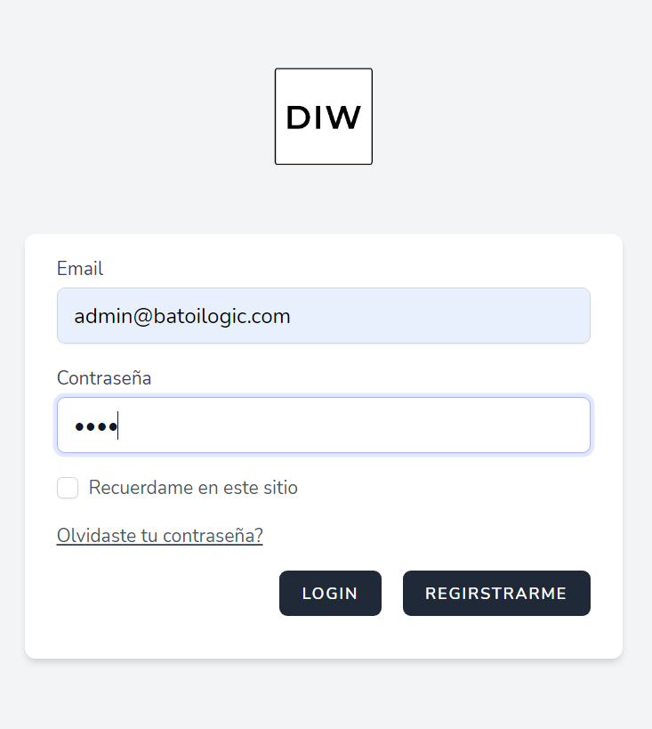
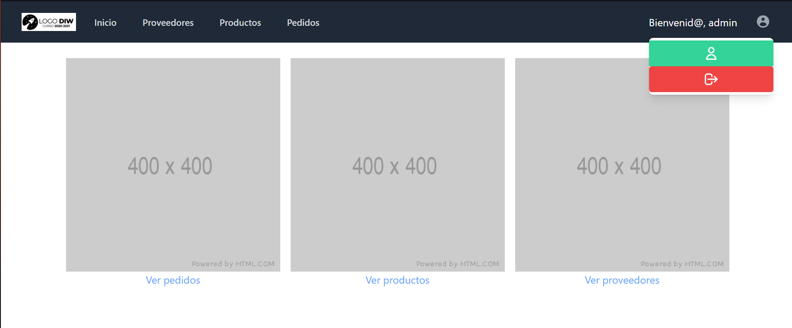
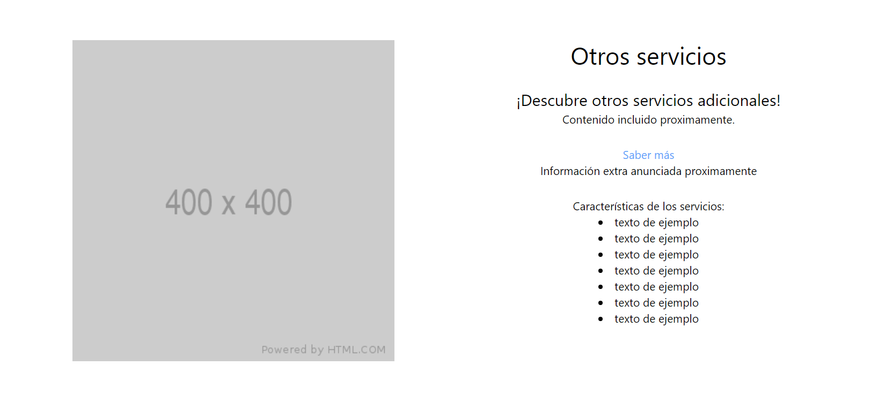
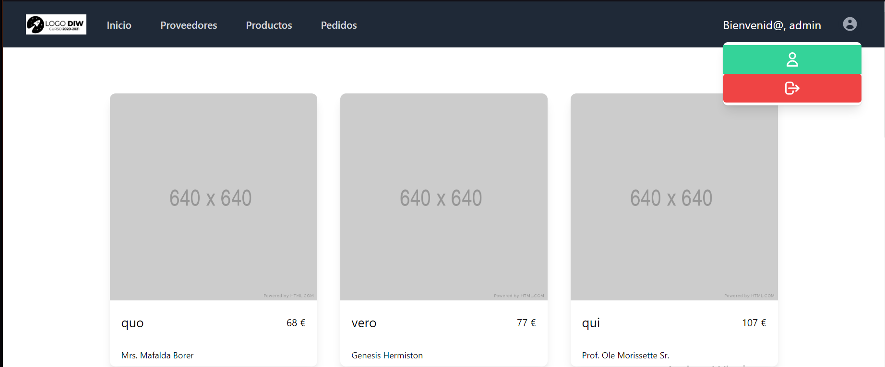
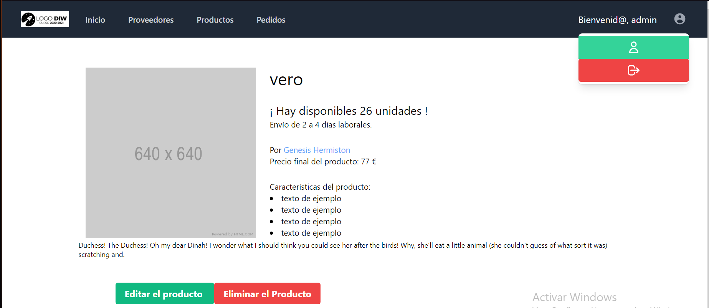
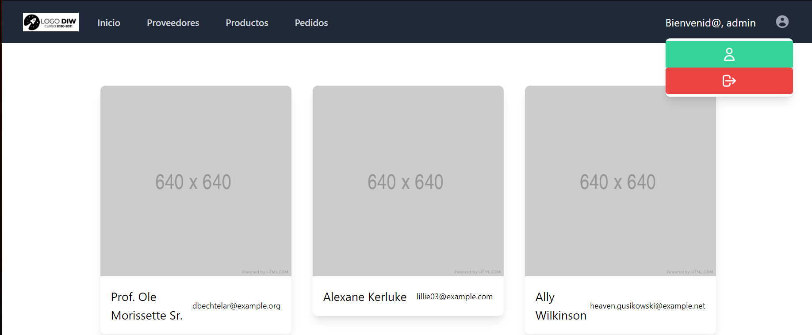
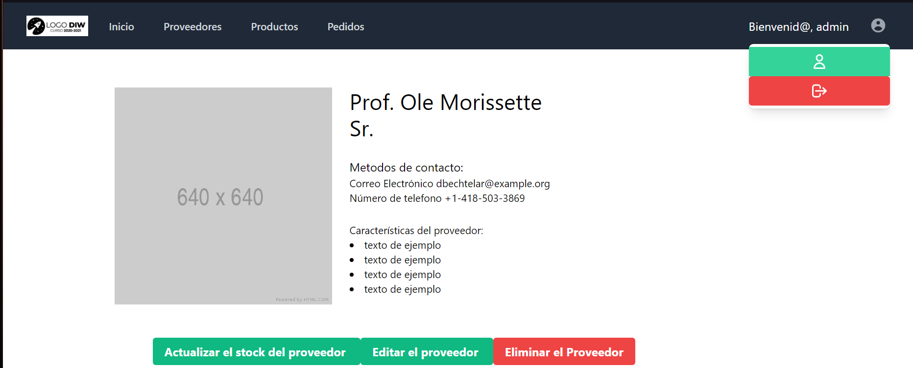
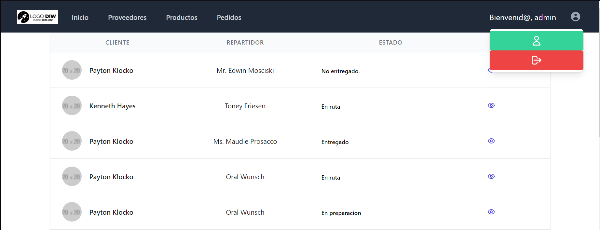
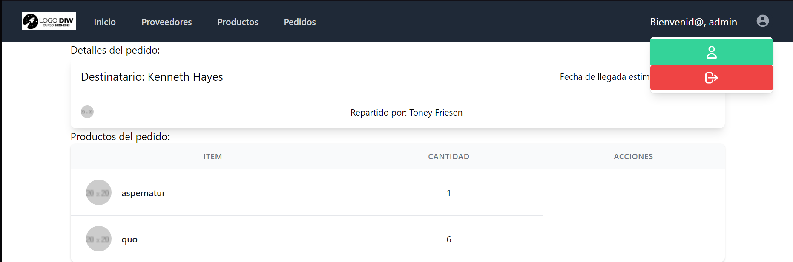

# Backoffice de Batoilogic

### Creado por Pablo Arévalo y Leo Román
 
## ¿ Qué es el Backoffice ?

En esta aplicación podremos consultar y hacer diferentes acciones con los datos de la empresa.

Podremos ver todos los pedidos a realizar, añadir productos, editar o añadir pedidos y mucho más.

Podremos acceder a esta aplicación como repartidores, usuarios normales o administradores, cada tipo de usuario podrá realizar diferentes acciones. Para probar estas funcionalidades, podremos usar unos usuarios de prueba, cuyos credenciales se mostrarán más adelante.


## Servidores DDAW

### SSH id_rsa.pub.
```
DNS:
ssh batoilogic@ec2-3-87-12-100.compute-1.amazonaws.com // ssh batoilogic@3.87.12.100
Base de datos:
ssh batoilogic@ec2-54-89-160-135.compute-1.amazonaws.com // ssh batoilogic@54.89.160.135
Web:
ssh batoilogic@ec2-3-87-71-72.compute-1.amazonaws.com // ssh batoilogic@3.87.71.72
```
### IP publicas
- DNS: 3.87.12.100
- Servidor de aplicaciones:  54.89.160.135
- Servidor web: 3.87.71.72
### Páginas + Enlaces
[www.g01.batoilogic.es](http:www.g01.batoilogic.es)  
[reparto.g01.batoilogic.es](http:reparto.g01.batoilogic.es)  
[backoffice.g01.batoilogic.es](http:backoffice.g01.batoilogic.es)


## Todos los repositorios del proyecto:
 
[CRUD y Backoffice -- Laravel](https://github.com/leshrike/batoilogic)  
[App de repartidor -- Vue JS](https://github.com/leshrike/repartidor_batoilogic)  
[App de tienda -- Vue JS](https://github.com/leshrike/tienda-batoilogic)  
[Estilos y Guia de estilos](https://github.com/olbapgit/BatoiLogicDiw)  


## Versiones

Para poner en funcionamiento esta aplicación hemos necesitado las siguientes aplicaciones o librerías :

### Aplicaciones o servicios de Servidor:
```yaml

-**Ubuntu** ubuntu 20.04 // Las instancias seleccionadas en las que funcionan las app y servicios.

-**Servidor Web** nginx 1.18.0 // El servidor web que aloja las app y sus configuraciones

-**mysql:** mysql 8.0.23 // Servicio o aplicación de base de datos en la que almacenamos toda la información

-**Servidor DNS** bind 9.16 // Servicio de resolución de nombres de dominio.

-**php:** php 7.4.3 // Lenguaje de programación

-**php-fpm:** php7.4-fpm // Intérprete del lenguaje PHP
```

### Librerías o dependencias utilizadas en el Backoffice de Batoilogic
```yaml

-**laravel**: laravel 8.12 // framework en el cual ha sido creada la app

-**dompdf**: lavravel-dompdf // librería que permite convertir una parte concreta del DOM (Document Object Model) en un pdf.

-**filedroper/proxy** filedroper/proxy 4.4 

-**guzzle/http** guzzle 7.0.1

-**fruitcake/laravel-cors** fruitcake 2.0

-**deployer** deployer 6.8 // herramienta de despliegue PHP

-**faker** fakerphp/faker 1.9.1 // genera datos de prueba de forma automática

-**jetstream** laravel/jetstream  2.1 // estructura de autenticación

-**sanctum** laravel/sanctum 2.9 // estructura de autenticación, se usa como alternativa a passport.

-**livewire** laravel/livewire 2.0

-**tailwindcss** 2.0.1 // framework css que utiliza jetstream por defecto
 ```

## Usuarios para probar las funcionalidades


Dentro de esta aplicación tendremos diferentes funcionalidades que son exclusivas para cada rol usuario. Para probarlas, podremos hacer uso de los siguientes usuarios:

### Usuario Administrador

``` prolog

    usuario: admin
    email:   admin@batoilogic.com
    contraseña: 1234
    
```

### Usuario Repartidor / Dealer

```prolog

    usuario: dealer
    email:   dealer@batoilogic.com
    contraseña: 1234
```

## Vista previa de la aplicación

Dentro de la  aplicación podremos ver diferentes menús y paneles en los cuales podremos interactuar. Por motivos de seguridad y usabilidad, hay elementos que  pueden aparecer o desaparecer en función del tipo de usuario con el cual tengamos iniciada sesión.

### Panel de Log-In



### Panel de Inicio





### Panel de productos



### Vista de un producto



### Panel de proveedores



### Vista de un proveedor



### Panel de Pedidos



### Ver pedido



## Instalación local

Para poder hacer que esta aplicación se ejecute deberemos seguir los siguientes pasos:

### Obtener todos los ficheros

En primer lugar, deberemos descargar los ficheros de este repositorio. Haciendo click en el botón verde en el que pone CODE. 


### Modificar el fichero .env

En este fichero podremos hacer todos los cambios relativos al entorno de programación. Normalmente recibiremos un ejemplo de este fichero, el cual podremos copiar y rellenar con nuestra configuración personal. Este fichero de ejemplo suele llamarse .env.example

En su interior deberemos cambiar:

#### Ubicación del codigo de la aplicación
```prolog
APP_CODE_PATH_HOST=../batoilogic/

Nota: si no se le especifica, será la ruta en la que se encuentra el fichero .env

```
#### Credenciales de la Base de Datos
```prolog
DB_CONNECTION=mysql
DB_HOST=mysql
DB_PORT=3306
DB_DATABASE=batoilogic
DB_USERNAME=root
DB_PASSWORD=root

```
Nota: Al realizar una instalación local, los credenciales de la base de datos no son tan importantes, aunque se pueden modificar a nuestro antojo en los campos USERNAME y PASSWORD

#### Modificar el nombre y URL de la aplicación

```prolog
APP_NAME=Batoilogic
APP_URL=http://batoilogic

```
Nota: Esta configuración es opcional, pero nos hace más facil reconocer el proyecto en el que estamos trabajando.


### Configuración y puesta en marcha del entorno:

Nota: Este proceso es la forma de funcionar haciendo uso de la Laradock, en un Windows. Asumiremos para esta explicación que el usuario ya tiene "Laradock" instalado en su equipo.

#### Puesta en marcha de los containers

Para poner en marcha el sistema de laradock, deberemos abrir una terminal y dirigirnos a nuestra carpeta laradock:

```prolog

docker compose up -d nginx mysql

```

O podemos acceder a la aplicación de Docker en modo gráfico (Docker desktop) y hacerlo de forma manual.


#### Acceder al bash

Para el desarrollo de nuestra aplicación en Laravel deberemos hacer uso de comandos como por ejemplo: "php artisan make:controller orderController" los cuales nos ayudarán a 
realizar todo tipo de componentes de nuestra aplicación de forma ágil.

Estos comandos no podremos introducirlos en el cmd de nuestro Windows, por ello, deberemos acceder al bash que tenemos a nuestra disposición en Laradock con el siguiente comando:


```prolog

docker-compose exec workspace bash

```

#### Instalar dependencias y librerías

Para la aplicación hemos hecho uso de librerías y componentes que no se encuentran disponibles para su uso de forma inmediata. Para poder conseguir que no hayan errores de este tipo, deberemos introduir lo siguiente:

```prolog

composer install -- Dependencias PHP

npm install -- Dependencias de JavaScript

```

Una vez composer haya finalizado, no deberíamos tener problemas ejecutando la aplicación.


#### Generar la clave del proyecto/aplicación

Para realizar funciones como la encriptación de cookies, laravel usa el valor APP_KEY localizado en el fichero .env, el cual tendremos que rellenar ejecutando lo siguiente:

```prolog

php artisan key:generate

```

#### Realizar las migraciones y creaciones de tablas

Para trabajar con los datos de la aplicación hacemos uso de bases de datos las cuales podemos crear gracias a las migraciones. Para ejecutar las migraciones y crear las bases de datos deberemos introducir el siguiente comando:

```prolog

php artisan migrate

```

#### Comprobaciones

Podremos comprobar que esta aplicación está en funcionamiento accediendo usando nuestro navegador a la ruta que hayamos establecido en el campo APP_URL o ejecutando la siguiente directiva:

```prolog
php artisan:serve 

```
Nota: al ejecutar la directiva superior, nuestra página web  se encontrará en http://localhost:8080

